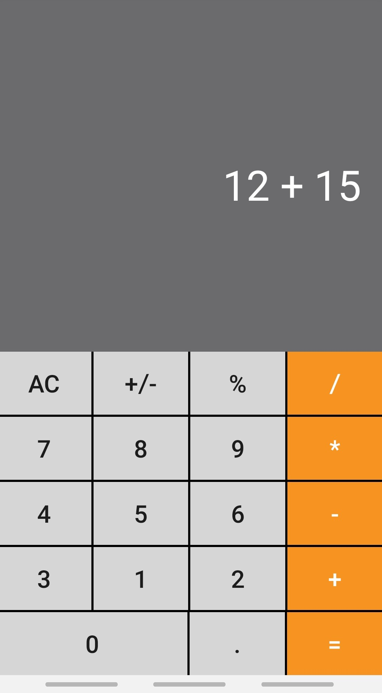

# Calculator

An Android Calculator app built in kotlin. The calculator is able to perform basic operations like addition, substraction, multiplication,
division and percentage calculation. For computation Infix to Postfix methodology is implemented which can be found using a simple google
search, thus enabling the user to write multiple operation together and then obtain the result. The application also support decimal 
point calculation. The application is made to work on multiple screens sizes namely: 

320dp: a typical phone screen (240x320 ldpi, 320x480 mdpi, 480x800 hdpi, etc) 
480dp: a large phone screen ~5" (480x800 mdpi). 
600dp: a 7” tablet (600x1024 mdpi). 
720dp: a 10” tablet (720x1280 mdpi, 800x1280 mdpi, etc). 

 </img>                    </img>
 </img>

